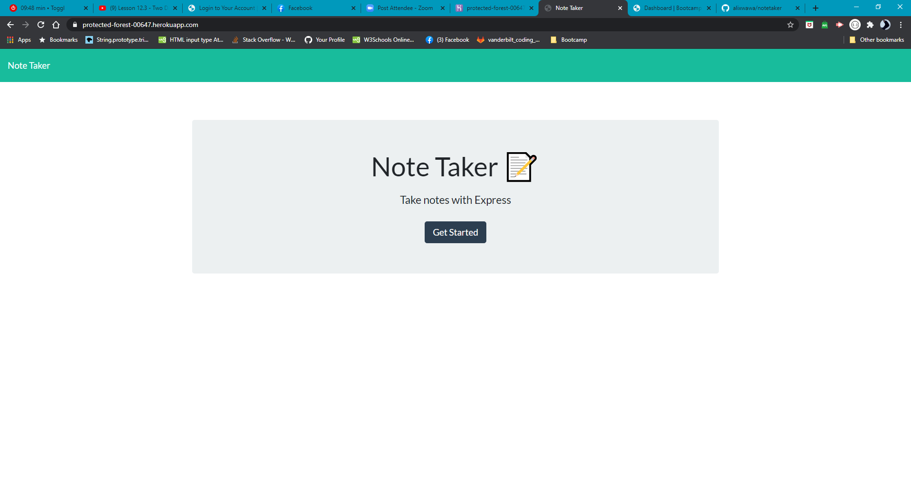
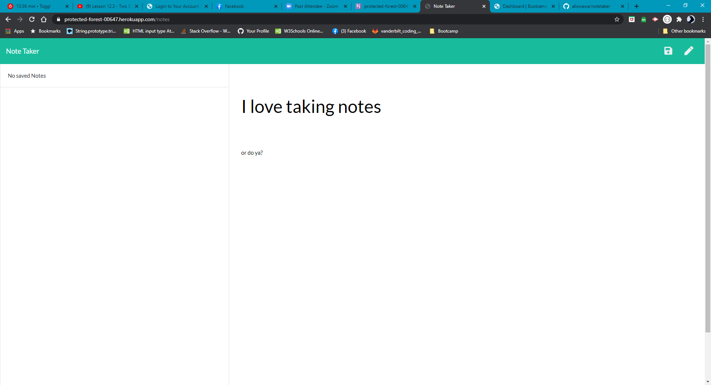
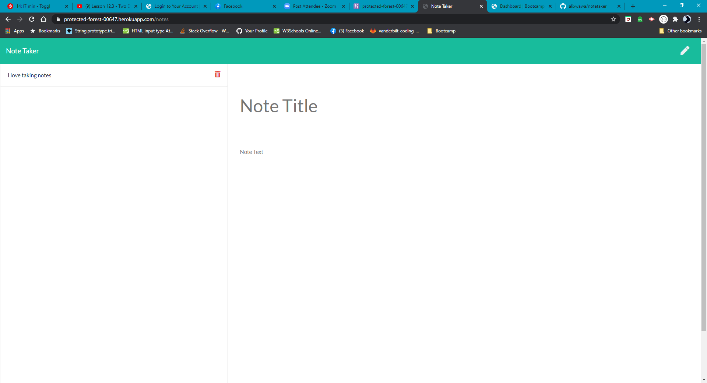

# Unit 11 Express Homework: Note Taker

## Description

Create an application that can be used to write, save, and delete notes. This application will use an express backend and save and retrieve note data from a JSON file.

### App working example

## Installation
Run:

                npm i

## Usage

This app uses front end and back end technologies to save notes to a database. 

## Repository

- [Project Repo](https://github.com/alixwawa/notetaker)
- [Heroku](https://protected-forest-00647.herokuapp.com/)